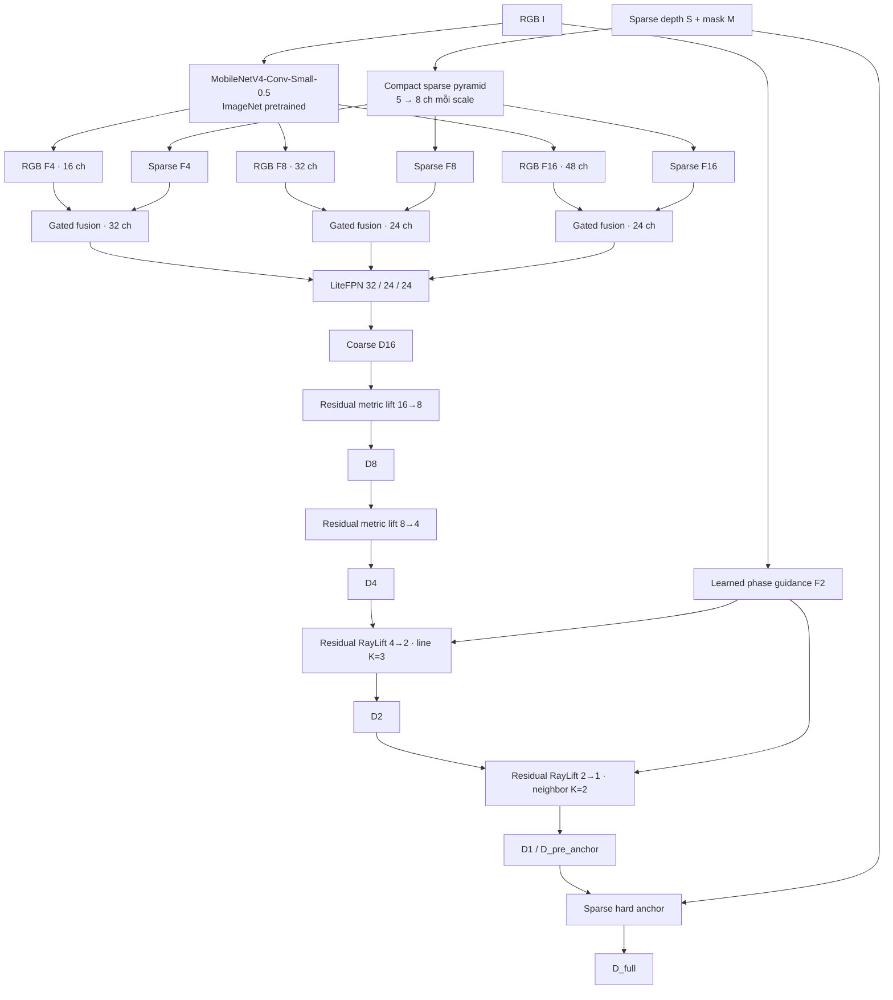

# GeoLift-S3 Lite — Technical Baseline

> **Trạng thái:** baseline chính, teacher-free, train end-to-end từ epoch đầu tiên<br>
> **Protocol:** KITTI Depth Completion · `352 × 1216` · 1.600 train / 400 validation / 1.000 anonymous test<br>
> **Cập nhật đặc tả:** 2026-08-13

Tài liệu này mô tả **implementation đang chạy trong repo**, không phải kiến trúc dự kiến. GeoLift-S3 Lite dùng RGB pretrained, một nhánh sparse depth rất nhỏ, hai bước residual metric lift ở độ phân giải thấp và chỉ dùng Residual RayLift ở hai bước độ phân giải cao.

## 1. Baseline contract

| Thuộc tính | Giá trị canonical |
|---|---|
| Model class | `GeoLiftStudentS3Lite` |
| Architecture key | `geolift_s3_lite` |
| RGB encoder | `mobilenetv4_conv_small_050.e3000_r224_in1k` |
| Encoder initialization | ImageNet pretrained; toàn encoder tiếp tục được fine-tune |
| Input thật sự dùng | RGB $I$, sparse depth $S$, mask $M$, intrinsics $K$ |
| Input API tương thích | `ray` và `uv` vẫn có trong chữ ký hàm nhưng bị loại ngay trong `forward` |
| Kích thước chuẩn | RGB `[B,3,352,1216]`; depth/mask `[B,1,352,1216]` |
| Miền depth | $d_{\min}=0.001\ \mathrm{m}$, $d_{\max}=120\ \mathrm{m}$ |
| Output học được | $D_{16},D_8,D_4,D_2,D_1$ |
| Output deploy/evaluate | $D_{\mathrm{full}}$ sau sparse hard anchor |
| Teacher khi train | Không dùng metric, geometry, normal hoặc monocular teacher |
| Số tham số | **369.209** trainable parameters |

ImageNet pretrained chỉ là **khởi tạo trọng số RGB encoder**. Nó không tạo thêm nhánh inference, không yêu cầu teacher TAR và không làm tăng số tham số/MAC khi deploy.

## 2. Kiến trúc tổng thể



### Tensor contract tại kích thước chuẩn

| Tensor | Channels | Spatial size | Vai trò |
|---|---:|---:|---|
| RGB $F_4,F_8,F_{16}$ | 16 / 32 / 48 | `88×304` / `44×152` / `22×76` | Feature RGB đa tỉ lệ |
| Sparse $F_4,F_8,F_{16}$ | 8 / 8 / 8 | `88×304` / `44×152` / `22×76` | Feature sparse độc lập |
| Fused/FPN $P_4,P_8,P_{16}$ | 32 / 24 / 24 | `88×304` / `44×152` / `22×76` | Feature decoder |
| $D_{16}$ | 1 | `22×76` | Coarse metric depth |
| $D_8$ | 1 | `44×152` | Low-resolution residual lift |
| $D_4$ | 1 | `88×304` | Low-resolution residual lift |
| $G_2$ | 12 | `176×608` | Learned phase-preserving RGB guidance |
| $D_2$ | 1 | `176×608` | High-resolution RayLift |
| $D_1,D_{\mathrm{full}}$ | 1 | `352×1216` | Pre-anchor và final depth |

$H$ và $W$ phải chia hết cho 16. RayLift không dùng tensor `ray` đầu vào; nó tự xây dựng ray chuẩn hóa từ $K$ và kích thước ảnh.

## 3. Các khối kỹ thuật

### 3.1. Compact sparse pyramid

Sparse depth không concat với RGB ở input. Tại tỉ lệ $1/4$, model dùng valid average pooling để không kéo depth về zero tại vùng thiếu đo:

$$
\bar S_4 = \frac{\operatorname{Pool}(S \odot M)}{\operatorname{Pool}(M)},
\qquad
M_4 = \mathbf{1}\!\left[\operatorname{Pool}(M)>0\right].
$$

Một cửa sổ $7\times7$ trên grid $1/4$ tạo local normalized prior:

$$
D_{\mathrm{init}}(p)
=
\frac{\sum_{q\in\mathcal N_7(p)} \bar S_4(q)M_4(q)}
     {\max\!\left(1,\sum_{q\in\mathcal N_7(p)}M_4(q)\right)},
\qquad
\rho_4(p)=\frac{1}{49}\sum_{q\in\mathcal N_7(p)}M_4(q).
$$

Mỗi state sparse có đúng năm kênh:

$$
X_s^S=
\left[
\frac{S_s}{d_{\max}},\ M_s,\
\frac{D_{\mathrm{init},s}}{d_{\max}},\ V_{\mathrm{init},s},\ \rho_s
\right].
$$

State được project thành 8 channels tại $s\in\{4,8,16\}$. Vùng không có support vẫn rỗng; code **không global-mean fill**, nhờ đó tránh scene-level depth shortcut.

### 3.2. Gated RGB–sparse fusion và LiteFPN

Với mỗi scale $s\in\{4,8,16\}$:

$$
I_s=P_I(F_s^I),
\qquad
Q_s=P_S(F_s^S),
$$

$$
g_s=\sigma\!\left(G_s([I_s,Q_s])\right),
\qquad
F_s=\operatorname{DWRes}\!\left(I_s+g_s\odot Q_s\right).
$$

Gate là spatial-channel map và được khởi tạo tại $g_s\approx0.10$. Fusion chỉ concat bên trong head gate $1\times1$; đường feature chính dùng gated addition, không dùng standard convolution rộng trên RGB+sparse concat.

$$
P_{16}=L_{16}(F_{16}),
$$

$$
P_8=R_8\!\left(L_8(F_8)+\operatorname{Up}(P_{16})\right),
$$

$$
P_4=R_4\!\left(L_4(F_4)+W_{8\rightarrow4}\operatorname{Up}(P_8)\right).
$$

$R_s$ là residual depthwise block; FPN width tại $P_4/P_8/P_{16}$ lần lượt là 32/24/24.

### 3.3. Coarse metric depth và low-resolution lift

Coarse head dự đoán metric depth dương trực tiếp:

$$
D_{16}=\operatorname{clip}
\left(
\operatorname{softplus}(h_{16}(P_{16})),
d_{\min},d_{\max}
\right).
$$

Bias đầu ra được khởi tạo để $D_{16}$ gần $20\ \mathrm{m}$. Hai bước $16\rightarrow8$ và $8\rightarrow4$ cập nhật trong inverse-depth space:

$$
\xi_{\mathrm{base}}=\operatorname{Bilinear}\!\left(D_{\mathrm{in}}^{-1}\right),
$$

$$
\Delta\xi=r\tanh(h_\Delta(Z)),
\qquad
g=\sigma(h_g(Z)),
$$

$$
D_{\mathrm{out}}
=
\left[
\operatorname{clip}
\left(
\xi_{\mathrm{base}}+g\Delta\xi,
d_{\max}^{-1},d_{\min}^{-1}
\right)
\right]^{-1}.
$$

Baseline dùng $r=0.02\ \mathrm{m}^{-1}$ và $g_0=0.05$. Hai stage này không chạy learned geometric sampling, nên giữ chi phí thấp ở decoder coarse.

### 3.4. Learned phase guidance

`phase_pack` tương đương PixelUnshuffle theo thứ tự phase $q_{00},q_{10},q_{01},q_{11}$. RGB được chuyển thành 12 channels tại $1/2$, sau đó xử lý bằng grouped $1\times1$, BatchNorm, SiLU và depthwise convolution:

$$
G_2=\operatorname{DWConv}
\left(
\operatorname{GroupPW}(\operatorname{PhasePack}(I))
\right).
$$

Thiết kế giữ thông tin subpixel nhưng không tạo learned feature map full-resolution. $G_2$ được phase-pack thêm một lần cho stage $4\rightarrow2$ và được dùng trực tiếp cho stage $2\rightarrow1$.

### 3.5. Residual RayLift

| Stage | Sampling mode | Hypothesis $K$ | Slope limit | Residual limit |
|---|---|---:|---:|---:|
| $4\rightarrow2$ | Learned line | 3 | 1.0 | $0.02\ \mathrm{m}^{-1}$ |
| $2\rightarrow1$ | Center + learned neighbor | 2 | 0.5 | $0.01\ \mathrm{m}^{-1}$ |

Với inverse-depth sample $\xi_k$, RayLift transport hypothesis theo camera-ray coordinates:

$$
\xi_k^{\mathrm{tr}}
=
\xi_k+a(x_t-x_k)+b(y_t-y_k).
$$

Hệ số $\eta$ blend sample gốc với sample đã transport; softmax tổng hợp các hypothesis:

$$
\tilde\xi_k=(1-\eta)\xi_k+\eta\xi_k^{\mathrm{tr}},
\qquad
\xi_{\mathrm{agg}}=\sum_{k=1}^{K}\operatorname{softmax}(\ell)_k\tilde\xi_k.
$$

Kết quả geometry được blend với bilinear inverse depth, sau đó residual correction sửa bias cục bộ:

$$
\xi_{\mathrm{RL}}
=(1-g_{\mathrm{RL}})\xi_{\mathrm{bil}}
+g_{\mathrm{RL}}\xi_{\mathrm{agg}},
$$

$$
\xi_{\mathrm{out}}
=
\operatorname{clip}
\left(
\xi_{\mathrm{RL}}+g_r\Delta\xi,
d_{\max}^{-1},d_{\min}^{-1}
\right).
$$

Khởi tạo gần bilinear: $\eta_0=0.02$, $g_{\mathrm{RL},0}=0.05$ và $g_{r,0}=0.05$. Confidence không có learned calibration loss; nó được truyền từ $C_{16}=1$ và giảm theo dispersion giữa các hypothesis.

### 3.6. Sparse hard anchor

Loss được tính trên prediction trước anchor. Output cuối thay đúng các pixel có sparse sensor hợp lệ:

$$
D_{\mathrm{full}}
=(1-M)\odot D_1
+M\odot\operatorname{clip}(S,d_{\min},d_{\max}).
$$

$$
C_{\mathrm{full}}=(1-M)\odot C_1+M.
$$

Hard anchor chỉ xuất hiện ở output cuối; không anchor lặp lại tại các scale trung gian.

## 4. Objective teacher-free

Tất cả loss bật từ epoch 0; không có curriculum Stage A/B/C:

$$
\mathcal L
=
\mathcal L_{\mathrm{metric}}
+0.2\mathcal L_{\log}
+0.1\mathcal L_{\mathrm{sparse}}
+0.05\mathcal L_{\mathrm{edge}}.
$$

Huber penalty được định nghĩa là:

$$
\rho_\delta(r)=
\begin{cases}
\frac{1}{2}r^2, & |r|\le\delta,\\
\delta\left(|r|-\frac{1}{2}\delta\right), & |r|>\delta.
\end{cases}
$$

### 4.1. Multi-scale metric loss

$$
\mathcal L_{\mathrm{metric}}
=
0.05\mathcal L_{D_{16}}
+0.10\mathcal L_{D_8}
+0.25\mathcal L_{D_4}
+0.50\mathcal L_{D_2}
+1.00\mathcal L_{D_1},
$$

$$
\mathcal L_{D_s}
=
\operatorname{mean}_{p\in\mathcal V_s}
\rho_{1.0}\!\left(D_s(p)-D_{\mathrm{gt},s}(p)\right).
$$

GT ở scale thấp là valid-area mean, không phải nearest resize. Các scale được cộng trực tiếp; code không chia tổng cho $0.05+0.10+0.25+0.50+1.00$.

### 4.2. Ba regularizer

| Term | Định nghĩa implementation |
|---|---|
| $\mathcal L_{\log}$ | Huber $\delta=0.1$ của $\log D_1-\log D_{gt}$ |
| $\mathcal L_{\mathrm{sparse}}$ | Mean L1 giữa `D_pre_anchor` và sparse sensor tại pixel hợp lệ |
| $\mathcal L_{\mathrm{edge}}$ | Tổng Huber $\delta=0.05$ của sai khác gradient log-depth theo trục $x$ và $y$ |

Các bin `[0,20,40,60,80,120]` m **chỉ dùng để đánh giá validation**. Baseline không có range-balanced loss. Các teacher loss, SSI, ordinal, normal và planarity đều tắt.

## 5. Training protocol

| Nhóm | Thiết lập canonical |
|---|---|
| Dataset | `selected_2000_ids.json` + `kitti_trainval_2000.tar` |
| Split | 1.600 train / 400 validation; sample ID và raw drive disjoint |
| Anonymous test | 1.000 ảnh KITTI, không có public GT |
| Epoch | 30 epoch, index `0…29` |
| Batch size | 2 |
| Optimizer | AdamW |
| Learning rate | $2\times10^{-4}$ cho toàn model |
| Weight decay | $10^{-5}$ |
| Scheduler | Warm-up 1 epoch → cosine decay; minimum LR ratio 0.05 |
| Precision | CUDA FP16 AMP |
| Stabilization | Gradient clipping 1.0, channels-last |
| Resume | Chỉ checkpoint S3 cùng kiến trúc; khôi phục model, optimizer, scaler, scheduler, epoch và best RMSE |

Notebook canonical: [`GeoLift_S3_Lite_TAR2000_Train1600_Val400_Test_OneRun.ipynb`](../notebooks/GeoLift_S3_Lite_TAR2000_Train1600_Val400_Test_OneRun.ipynb).

Input tối thiểu trên Drive:

```text
MyDrive/GeoLift_Data/teacher_subset_2000/
├── selected_2000_ids.json
└── kitti_trainval_2000.tar
```

Notebook tải official anonymous test trực tiếp từ KITTI, extract dữ liệu vào SSD `/content`, rồi đồng bộ checkpoint/log/result về:

```text
MyDrive/GeoLift_RT_runs/v3_s3_lite_pretrained_train1600_val400/
├── checkpoints/{best.pth,last.pth,epoch_*.pth}
├── logs/{train_log.csv,train_log.jsonl,train_student.log}
├── logs/{infer_val_metrics_global.json,geolift_component_profile.json}
├── experiment_record.json
├── s3_loss_budget.csv
├── s3_gate_dynamics.csv
├── s3_vs_s2_metrics.csv
├── s3_vs_s2_efficiency.csv
├── s3_vs_s2_benchmark.png
└── kitti_test_predictions.zip
```

## 6. Evaluation contract

Tập pixel hợp lệ:

$$
\mathcal V=
\left\{
i\mid M_{gt,i}=1,\ d_{\min}<D_{gt,i}<d_{\max}
\right\}.
$$

Primary metric là global pixel RMSE, không phải trung bình RMSE từng ảnh:

$$
\operatorname{RMSE}
=
\sqrt{
\frac{1}{|\mathcal V|}
\sum_{i\in\mathcal V}(D_i-D_{gt,i})^2
}.
$$

$$
\operatorname{MAE}
=
\frac{1}{|\mathcal V|}
\sum_{i\in\mathcal V}|D_i-D_{gt,i}|,
$$

$$
\operatorname{iRMSE}
=
\sqrt{
\frac{1}{|\mathcal V|}
\sum_{i\in\mathcal V}
\left(\frac{1000}{D_i}-\frac{1000}{D_{gt,i}}\right)^2
},
$$

$$
\operatorname{AbsRel}
=
\frac{1}{|\mathcal V|}
\sum_{i\in\mathcal V}
\frac{|D_i-D_{gt,i}|}{D_{gt,i}},
$$

$$
\delta_j
=
\frac{1}{|\mathcal V|}
\sum_{i\in\mathcal V}
\mathbf 1
\left[
\max\!\left(\frac{D_i}{D_{gt,i}},\frac{D_{gt,i}}{D_i}\right)<1.25^j
\right],
\qquad j\in\{1,2,3\}.
$$

iRMSE/iMAE dùng đơn vị $\mathrm{km}^{-1}$ theo hệ số 1000 trong code. Validation còn log global RMSE/MAE cho từng range, edge và non-edge. Edge mask được tạo từ gradient ảnh grayscale với threshold 0.05.

## 7. Baseline đã quan sát — epoch 0 đến 19

Nguồn: [`GeoLift-S3-Lite_TAR2000_train_log_epoch0_19.csv`](../results/GeoLift-S3-Lite_TAR2000_train_log_epoch0_19.csv). Đây là validation nội bộ trên 400 ảnh; **không phải KITTI leaderboard** và chưa đại diện cho checkpoint sau đủ 30 epoch.

| Metric | Epoch 0 | Epoch 19 | Thay đổi |
|---|---:|---:|---:|
| RMSE | 9.029 m | **1.510 m** | −83.3% |
| MAE | 4.694 m | **0.458 m** | −90.2% |
| AbsRel | 0.3391 | **0.0261** | −92.3% |
| $\delta_1$ | 0.5632 | **0.9889** | +42.6 điểm % |
| iRMSE | 39.20 $\mathrm{km}^{-1}$ | **310.40 $\mathrm{km}^{-1}$** | Xấu đi; cần kiểm tra outlier gần zero |

### Range breakdown tại epoch 19

| GT range | Global RMSE | Valid pixels | Tỷ lệ |
|---|---:|---:|---:|
| 0–20 m | 0.903 m | 19.685.953 | 77.43% |
| 20–40 m | 1.926 m | 4.254.287 | 16.73% |
| 40–60 m | 3.358 m | 1.120.771 | 4.41% |
| 60–80 m | 5.702 m | 355.995 | 1.40% |
| 80–120 m | 15.496 m | 7.986 | 0.03% |

Global RMSE chịu chi phối mạnh bởi vùng 0–20 m. Mọi thay đổi tiếp theo phải báo đồng thời global, near/far range và edge metrics; không kết luận chỉ từ một scalar.

### Weighted loss budget tại epoch 19

| Weighted term | Giá trị đóng góp | Tỷ lệ total loss |
|---|---:|---:|
| $1.0\mathcal L_{\mathrm{metric}}$ | 0.886571 | 90.74% |
| $0.2\mathcal L_{\log}$ | 0.000268 | 0.027% |
| $0.1\mathcal L_{\mathrm{sparse}}$ | 0.090189 | 9.23% |
| $0.05\mathcal L_{\mathrm{edge}}$ | 0.000012 | 0.001% |

Hệ số loss không phải phần trăm đóng góp thực tế. Log và edge term đang rất nhỏ theo magnitude; đây là dữ kiện cần theo dõi, chưa phải lý do để thay objective baseline.

## 8. Inference footprint và profiling

### Parameter breakdown

| Component | Parameters | Tỷ lệ model |
|---|---:|---:|
| MobileNetV4 RGB encoder | 340.992 | 92.36% |
| Compact sparse pyramid | 672 | 0.18% |
| Gated fusion tại F4/F8/F16 | 11.040 | 2.99% |
| LiteFPN | 5.384 | 1.46% |
| Coarse $D_{16}$ head | 913 | 0.25% |
| Residual metric lift $16\rightarrow8\rightarrow4$ | 4.020 | 1.09% |
| Phase guidance + source2 | 684 | 0.19% |
| Hai Residual RayLift stage | 5.504 | 1.49% |
| **Tổng** | **369.209** | **100%** |

Không ghi một latency cố định trong đặc tả vì runtime phụ thuộc GPU, CUDA/cuDNN, PyTorch, warm-up và precision. Profiler canonical đo FP16 batch 1, median/P95, peak VRAM và timing theo component:

```bash
python scripts/profile_geolift_s3.py \
  --config configs/geolift_s3_lite_tar2000.yaml \
  --height 352 \
  --width 1216 \
  --warmup 100 \
  --runs 500 \
  --output student_outputs/logs/geolift_s3_component_profile.json
```

`estimated_conv_linear_macs` chỉ đếm Conv2d/Linear. Nó không đếm `grid_sample`, interpolation, phase pack/unpack, tensor layout và memory traffic; vì vậy **CUDA timing mới là số runtime có giá trị quyết định**.

## 9. Reproducibility gates

Một run chỉ được xem là so sánh hợp lệ khi thỏa toàn bộ:

- cùng `selected_2000_ids.json`, split và `protocol_sha256`;
- đúng 1.600 train, 400 validation, 1.000 anonymous test;
- không trùng sample ID hoặc raw drive giữa train/validation;
- cùng image size, depth scale và depth bounds;
- báo `val_rmse` global pixel cùng range/edge/iRMSE;
- báo parameter count, FP16 median/P95 latency và peak VRAM trên cùng thiết bị;
- giữ `experiment_record.json`, resolved config, checkpoint và raw log.

Chạy contract tests trước train:

```bash
python -m unittest discover -s tests -v
```

## 10. Giới hạn đã biết

- Phân bố GT nghiêng mạnh về 0–20 m; objective hiện không range-balance vùng xa.
- iRMSE epoch 19 bất thường dù RMSE tốt lên, gợi ý một lượng nhỏ prediction sát $d_{\min}$. Cần inspect prediction histogram/outlier trước khi chọn checkpoint bằng iRMSE.
- Edge loss có weighted magnitude gần zero trong log hiện có.
- Confidence là tín hiệu analytic, chưa được calibration bằng ground truth.
- RayLift chứa `grid_sample`; MAC Conv/Linear không phản ánh đầy đủ latency của block này.
- Anonymous test không có GT công khai; file ZIP chỉ dùng để submit benchmark.

## 11. Source of truth

| Phần | File canonical |
|---|---|
| Model | [`src/model_geolift_s3.py`](../src/model_geolift_s3.py) |
| RayLift primitive | [`src/model_geolift_s2.py`](../src/model_geolift_s2.py) |
| Objective | [`src/losses.py`](../src/losses.py) — `geolift_s3_loss` |
| Model factory | [`src/model_factory.py`](../src/model_factory.py) |
| Config | [`configs/geolift_s3_lite_tar2000.yaml`](../configs/geolift_s3_lite_tar2000.yaml) |
| Train/validation | [`src/train_student.py`](../src/train_student.py) |
| Inference | [`src/infer_student.py`](../src/infer_student.py) |
| Component profiler | [`scripts/profile_geolift_s3.py`](../scripts/profile_geolift_s3.py) |
| Contract tests | [`tests/test_geolift_s3_contracts.py`](../tests/test_geolift_s3_contracts.py) |
| Colab workflow | [`notebooks/GeoLift_S3_Lite_TAR2000_Train1600_Val400_Test_OneRun.ipynb`](../notebooks/GeoLift_S3_Lite_TAR2000_Train1600_Val400_Test_OneRun.ipynb) |

Khi tài liệu và code khác nhau, các file canonical ở bảng trên là nguồn kiểm chứng. Một thay đổi kiến trúc chỉ được nhập vào baseline sau khi có run protocol-locked và báo đủ accuracy lẫn efficiency.
