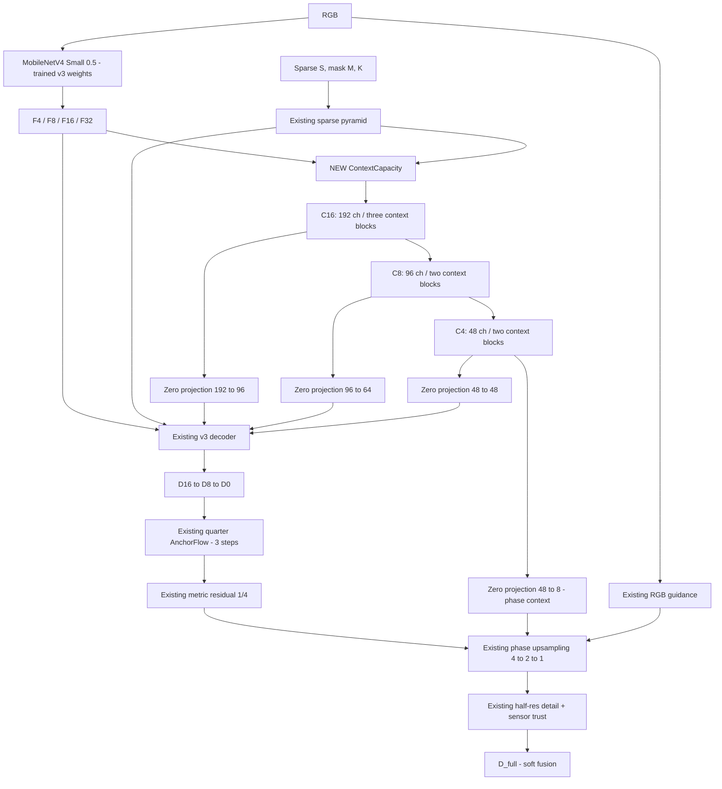

# AnchorFlow v4 ContextWide · model-only capacity upgrade

V3 là baseline đã kiểm chứng **1,04537m**, v4 là candidate chưa train. Data/loss/evaluator dùng chung, đổi model bằng một biến trong notebook.

## 1. Graph

Forward inputs chỉ rgb,sparse,mask,K. Teacher và GT chỉ trong training objective. Không thêm attention/grid_sample hoặc full-resolution CNN feature.

## 2. Bản mới khác đúng ở đâu?

Trong **model_v4.py**, thêm module **capacity** và override hai hook decode/phase_context. Model factory giữ model_v3.py như control. Base primitive ở core.py dùng chung.

| Stage | Input | Latent width | Context blocks | Output injection |
|---|---|---:|---|---|
| F32→1/16 | F32(480) + F16(48) + sparse16(16) | 192 | 3× expansion4, DW5, dilation1/2/3 | Add96ch vào fusedF16 |
| 1/16→1/8 | C16 + F8(32) + sparse8(16) | 96 | 2× expansion3, DW5, dilation1/2 | Add64ch vào P8 |
| 1/8→1/4 | C8 + F4(16) + sparse4(16) | 48 | 2× expansion2, DW5, dilation1/2 | Add48ch vào P4 |
| Phase context | C4 | 8 | PW48→8, nearest resize | Add vào P2 context |

Context block dùng PW expansion → depthwise5×5 → PW projection, BN/SiLU và residual. Top-down resize bilinear, fusion additive. Tại1/16 còn có global mean descriptor qua hai1×1 conv192→48→192; không BN trên descriptor1×1.

Cấu trúc duy trì **latent feature đa kênh** từ coarse đến fine thay vì chỉ truyền một scalar depth; kênh cũ và pretrained encoder được giữ. Dilation tăng receptive field, không phải adaptive non-local graph.

## 3. Function-preserving warm-start

Với residual branch B_s:

$$
P_s^{\mathrm{new}}=P_s^{\mathrm{v3}}+W_sB_s.
$$

Bốn projection W16/W8/W4/W2 và bias đều zero khi tạo model.
Do đó **D_full v4 ban đầu bằng D_full v3**, không chỉ gần nhau do gate nhỏ.

- Nạp đủ **697 state tensors /572.017 trainable parameters** của v3.
- Không drop key, không reshape tùy tiện. Chỉ cho phép thiếu capacity.*.
- Test checkpoint thật đã xác nhận max output difference **0** trên3 ảnh KITTI full-resolution được chọn trước (vị trí1/200/400), cùng CPU FP32.
- Bước gradient đầu cập nhật output projection; khi mở, gradient vào capacity trunk. Không freeze toàn model.

Sensor trust đã học từ v3 giữ nguyên; không reset gate về init0,9. Model vẫn output D_hard để audit, không dùng hard-anchor làm primary.

## 4. Compute đã đếm

Input352×1216, batch1; một multiply-add là một MAC:

| Model/component | Params | Conv/Linear MAC |
|---|---:|---:|
| V3 toàn bộ | 572.017 | 2,97414G |
| Capacity mới | 1.285.704 | 3,36949G |
| **V4 toàn bộ** | **1.857.721** | **6,34363G** |

Không đổiwidth high-res của phase/detail v3. Phần CNN thêm chỉ chạy1/32,1/16,1/8,1/4; projection P2 thực hiện trước resize.
FP16 cho learned convolution, FP32 cho depth moments, metric fusion/loss; channels-last, fused AdamW, CUDA reductions. Không có loop Python theo pixel hoặc matrix inversion.

MAC không tính đủ pooling/interpolation/scalar/memory và fixed neighborhood convolution. **Chưa có v4 GPU latency/VRAM**. Notebook profile parent v3 và best candidate bằng subprocess riêng trên cùng GPU, settings giống nhau; không so A100 với T4.

## 5. Shared training recipe

| Thiết lập | Giá trị |
|---|---|
| Parent | V3 best epoch14, cumulative29, SHA kiểm trong config |
| Thêm epoch | 15, new0–14/cumulative30–44 |
| Dataset | 1.600train/400val/1.000anonymous test, cùng manifest |
| Teacher | Metric D_cm/C_cm, train only, confidence≥0.5 |
| KD exclusion | GT và sparse gốc kể cả holdout; coarse cell bị block nếu cóGT/sparse |
| Optimizer | AdamW, weight_decay1e-5 |
| Peak LR | Encoder2.5e-5, **mọi non-encoder1e-4**, cả v3 và v4 |
| Schedule | 1epoch warm-up → cosine, minimum0.05 |
| Batch/holdout/flip | 2 /10% sparse holdout /horizontal flip |
| Precision | FP16 AMP, encoder BN frozen, gradient clip1 |
| Parent optimizer | Reset khi chuyển experiment; resume cùngrun khôi phục đầy đủ |
| Selection | Global-pixel soft RMSE, so cả initial epoch-1 |
| Comparison key | recipe_sha256 khóa data/loss/recipe, loại model_name/architecture/run_name |

Objective v3 **không đổi**:

$$
L=L_{\mathrm{multi}}+0.25L_{\mathrm{RMSE}}+0.10L_{\mathrm{range}}
+0.2L_{\mathrm{log}}+0.05L_{\mathrm{edge}}
+0.02L_{\mathrm{sparse}}+0.05L_{\mathrm{holdout}}
+0.02L_{\mathrm{trust}}+\lambda_{\mathrm{KD}}L_{\mathrm{KD}}
+0.02L_{\mathrm{teacher\_edge}}.
$$

Multi-scale Huber weights D16/D8/D4/D2/D1/D_full:0.025/0.05/0.15/0.30/0.50/1.
KD weights D4/D2/D1:0.25/0.5/0.25. LambdaKD0.05→gần0.025 qua15epoch.
Range bins[0,20,40,60,80,120], coefficients1/1/1/1/0.25, tối thiểu64pixel/bin.
Mọi loss được triển khai một lần trong losses.py/loss_helpers.py, không riêng từng model.

LR non-encoder được thống nhất ở1e-4 cho **hai run continuation**; không tái diễn recipe “new v3 heads2×LR” của lần v2→v3 trước. Vì thế phải dùng control mới để kết luận model-only, không lấy run v3 cũ khác ngân sách/schedule làm control hoàn hảo.

## 6. Tài liệu nghiên cứu tham khảo

- [DFU, CVPR2024](https://openaccess.thecvf.com/content/CVPR2024/html/Wang_Improving_Depth_Completion_via_Depth_Feature_Upsampling_CVPR_2024_paper.html): nhấn mạnh giữ dense depth features khi coarse-to-fine. V4 dùng latent pyramid/additive injection, **không tái hiện adaptive CGM** của DFU.
- [GBPN, arXiv2026](https://arxiv.org/abs/2601.21291): học long-range dependencies và propagation sparse. V4 chỉ lấy định hướng mở rộng context; **không có Gaussian belief propagation, MRF hay learned non-local edges**.
- [OMNI-DC, ICCV2025](https://openaccess.thecvf.com/content/ICCV2025/html/Zuo_OMNI-DC_Highly_Robust_Depth_Completion_with_Multiresolution_Depth_Integration_ICCV_2025_paper.html): multiresolution integration hỗ trợ sparse đa dạng. V4 không có solver của paper; chỉ sử dụng multi-scale CNN capacity.
- [LP-Net, preprint2025](https://arxiv.org/abs/2502.07289): coarse-to-fine context và detail. Không gán venue CVPR hoặc claim tái hiện LP-Net.

Đây là engineering hypothesis dựa trên log và các nguyên lý multi-scale, **không claim kiến trúc tối ưu nhất/SOTA**. Cần matched-budget control, nhiều seed và dữ liệu held-out trước khi kết luận contribution.

## 7. Contract evaluation giữ nguyên

352×1216, depth theo mét, validGT0.1<GT<120, scale256. Global pixel metric, không trung bình RMSE từng ảnh.
Log soft/pre/hard, range/edge/iRMSE và native-stage diagnostics. Không dùng GT làm input, không clamp evaluator mới, không loại outlier hay đổivalidationIDs để đạt target.
