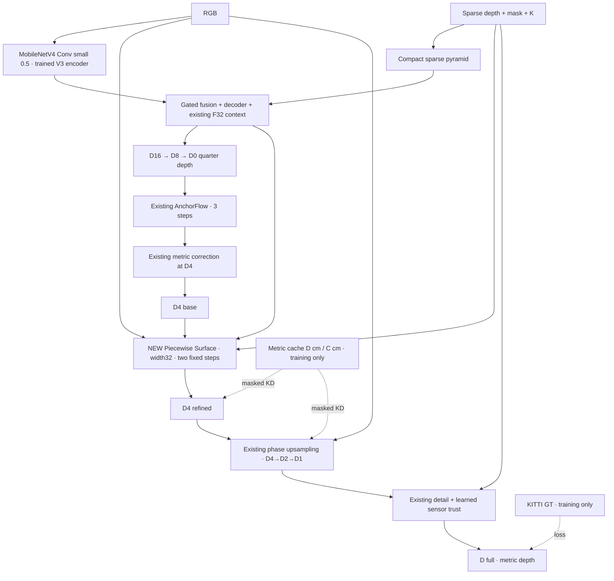

# AnchorFlow V5 — Ray-Constrained Piecewise Surface Correction

**Research prototype, không phải SOTA đã được xác nhận.** Chọn V3 làm parent để thử geometric inductive bias rẻ thay cho tăng generic context như V4.

## 1. Graph



Fallback nếu preview không hỗ trợ Mermaid:

```text
trained V3 encoder + sparse pyramid + decoder
                  ↓
            D16 → D8 → D0
                  ↓
      existing AnchorFlow ×3 + metric4
                  ↓
               D4_base
                  ↓
  NEW width32 surface head → two quarter-grid updates
                  ↓
                 D4
                  ↓
  existing phase upsampling → D2 → D1 → sensor trust → Dfull
```

RGB `[B,3,352,1216]`; S/M `[B,1,352,1216]`; K `[B,3,3]`. `P4`48channels và D4 ở88×304. Không full-resolution learned feature branch mới, không attention, adaptive solver, grid_sample hay point-cloud splatting. GT/teacher không nằm trong chữ ký forward.

## 2. Một nhánh nhỏ, geometry rõ ràng

`P4(48)` + average-pooled RGB(3) + state(7) →58channels → PW58→32 + residual DW/PW block + DW5×5 → bốn head1×1:

| Head | Channels | Ý nghĩa |
|---|---:|---|
| slopes | 2 | Local inverse-depth slopes theo normalized camera x/y |
| conductance | 2 | Conductance trên cạnh phải/dưới |
| barriers | 2 | Xác suất discontinuity trên cạnh phải/dưới |
| reaction | 1 | Direct bounded metric residual |

State7 gồm depth/120, sparse innovation/20, validity, density, relative std, camera x/y. Sensor spread là descriptor quan sát, **không gọi là calibrated sensor confidence**. Final learned sensor trust được giữ phía sau; không sử dụng kết quả tương lai của nó làm input nhánh quarter.

### 2.1. Plane transport trên cùng target ray

Với Z-depth D và pinhole camera:

$$
x_p=(u_p-c_x)/f_x,\qquad y_p=(v_p-c_y)/f_y,\qquad \xi_p=1/D_p.
$$

Nếu một mặt phẳng có phương trình `n·X=c`, inverse depth affine theo normalized camera coordinates. Mỗi neighbor q đưa hypothesis của mặt phẳng cục bộ tới ray p:

$$
\widehat\xi_{q\to p}=\xi_q+a_q(x_p-x_q)+b_q(y_p-y_q).
$$

Code dùng `a,b = 0.5 tanh(head)`; quarter-grid spacing tương ứng4pixel ảnh gốc, nên khoảng ray là4/fx và4/fy. Hypotheses clamp vào inverse-depth bounds trước aggregate. Không dời u/v, không reprojection: **ray-constrained geometric correction**, không tuyên bố free-form 3D flow như ShapeFlow.

### 2.2. Directional symmetric barriers

Mỗi cạnh phải/dưới có một logit conductance `l` và barrier `e`; trái/trên reuse đúng cạnh của pixel trước:

$$
w_{pq}=\tfrac14\sigma(l_{pq})[1-\sigma(e_{pq})].
$$

Ở biên ảnh, nonexistent-neighbor weight bằng0. `w(p,q)=w(q,p)`, mỗi cạnh tối đa1/4. Aggregate có center/self mass:

$$
\xi_p^*=(1-\sum_q w_{pq})\xi_p+\sum_qw_{pq}\widehat\xi_{q\to p}.
$$

Giảm tất cả conductance làm **giảm tổng transport**: không normalize neighbor-only để rồi triệt tiêu barrier. Chặn hướng ngang không bắt buộc chặn hướng dọc. Đây là learned discontinuity suppression, **không phải visibility/occlusion ground truth**, không bảo đảm mọi boundary đều được chặn đúng.

### 2.3. Hai bước bounded metric correction

Cached head outputs dùng lại trong hai bước; depth state và geometric proposal cập nhật mỗi bước. Đặt `A=0.5 tanh(amplitude)`, `R=tanh(reaction)`, `B(D)=0.5+0.05D` mét:

$$
D^{t+1}=\mathrm{clip}\left(D^t+\tfrac12\left[A\,\mathrm{clip}(1/\xi^*-D^t,-B(D^t),B(D^t))+B(D^t)R\right],0.1,120\right).
$$

`t=0,1` cố định. A là **signed residual readout**, không phải positive diffusion time hay confidence probability. Negative A có thể sharpen/anti-smooth; bounds hạn chế cập nhật nhưng không bảo đảm convergence như numerical PDE solver. Reaction sửa metric bias; transport cung cấp local-surface hypothesis. Không claim continuous ODE training/solving.

### 2.4. Exact no-op migration

Nạp đủ697 tensors/572.017 params parent. New heads zero-init, barrier bias−2; A=0 và R=0 nên D4 mới khớp D4 cũ. Parent Dfull tái tạo chính xác trên ba ảnh KITTI full-size local.

Step đầu reaction head/amplitude và barrier BCE có gradient; trunk/slopes mở sau cập nhật head. Không phải “mọi tham số mới đều có gradient khác0 từ batch đầu”. Không reset encoder hoặc final trust.

Log riêng `surface_transport_abs_delta_mean` và `surface_reaction_abs_delta_mean` để kiểm geometry có thực sự đóng góp, không chỉ direct reaction head. Hai trace là pre-clamp step contributions; tổng không bắt buộc khớp final delta nếu depth chạm bounds. Camera slope offsets/conductance được cache một lần cho hai bước để tránh lặp GPU kernels không cần thiết.

## 3. Training objective

Giữ objective V3 nguyên bản: multi-scale Huber metric; global RMSE0,25; range RMSE0,10; log0,20; GT log-gradient0,05; quality-weighted sparse0,02/holdout0,05; sensor-trust BCE0,02; metric KD0,05→gần0,025; teacher gradient0,02. Các scale metric: D16/D8/D4/D2/D1/Dfull =0,025/0,05/0,15/0,30/0,50/1.

V5 default chỉ thêm **hai term**:

$$
\mathcal L=\mathcal L_{V3}+0.05\mathcal L_{GT\,band3}+0.01\mathcal L_{barrier}.
$$

- `GT band3`: RMSE trên valid GT gần observed GT discontinuity, mask cố định không phụ thuộc prediction. Cùng term cho V3/transport controls.
- `barrier`: class-balanced BCE riêng positive/negative trên cặp quarter GT clean; chỉ full V5 active. Không thêm learned-mask weighted depth loss, tangent loss, slope teacher, normal loss hay topology module.

Observed GT discontinuity: adjacent valid pixels, jump > max(1m,0,05×min depth). Quarter label: valid-area-mean GT, mỗi cell ít nhất2 valid pixels và relative std≤0,05, rồi kiểm jump tương tự. Reject mixed cells để không dạy barrier theo trung bình foreground/background. GT sparse không đủ nhãn cho mọi edge; log support và positive fraction, không fill invalid label thành negative.

KD chỉ lấy `C_cm≥0.5`, ở ngoài GT và **toàn bộ sparse gốc**, cả sensor holdout. Coarse cell chứa GT/sensor bị loại khỏi KD. Teacher chỉ train, không val/test. Không đổi range weighting, augmentation hoặc benchmark mask để làm gain giả.

## 4. Efficiency

| Model | Params | Conv/Linear MAC at352×1216 | A100 FP16 median lịch sử |
|---|---:|---:|---:|
| V3 | 572.017 | 2,974 G | 25,932 ms |
| V4 ContextWide | 1.857.721 | 6,344 G | 31,010 ms |
| V5 proposed | **579.993** | **3,176 G** | **Chưa đo GPU** |
| Nhánh mới | 7.976 | 0,202 G | Đo riêng sau train |

Tăng1,39%params,6,79%ConvMAC so V3. Không suy ra latency+6,79%: shifts/transport/elementwise/memory traffic không nằm trong MAC. Head Conv dùng AMP; depth/ray/inverse-depth/reductions dùng FP32; không loop Python qua pixel hoặc tạo ma trận NxN. AdamW fused, channels-last, pinned-memory loader giữ như pipeline cũ. CUDA/edge-device latency phải đo thật cùng môi trường.

## 5. Evaluation và acceptance

Primary: global pixel RMSE trên đúng25.424.992 valid GT pixels/400val; không thay bằng average image-RMSE. Giữ MAE/iRMSE và range0–20/20–40/40–60/60–80/80–120m, RGB-edge cũ, soft/pre/hard policies.

Mới: **GT-boundary bands + disjoint rings**, radius1/2/3/5/10pixel theo Chebyshev distance, RMSE/MAE/SSE share và bad-pixel rates lỗi>1/2/3/5/10m. Đây là protocol nội bộ explicit, không phải metric KITTI leaderboard chuẩn hay Euclidean edge distance.

Hypothesis pass: V5 giảm global và GT-band errors ở matched-budget control, không đánh đổi far RMSE nghiêm trọng, overhead GPU hợp lý. `<1.02m` là mốc nghiên cứu gần V4, không guarantee. `<0.7m` là mục tiêu dài hơn; cần giảm hơn53%MSE từ V4 best và không được suy từ một tiny module.

## 6. Novelty scope và prior art

Candidate contribution: **camera-ray plane transport with symmetric directional non-normalized barriers, bounded metric reaction and exact-no-op quarter-resolution realization**. Đây là thiết kế cần ablation, không kết quả chứng minh novelty độc quyền.

Plane/normal geometry và noisy-sensor confidence đã có trong [Depth-Normal Constraints, ICCV2019](https://openaccess.thecvf.com/content_ICCV_2019/html/Xu_Depth_Completion_From_Sparse_LiDAR_Data_With_Depth-Normal_Constraints_ICCV_2019_paper.html). Vì vậy không claim “first geometric diffusion/plane transport”.

[TWISE, CVPR2021](https://openaccess.thecvf.com/content/CVPR2021/html/Imran_Depth_Completion_With_Twin_Surface_Extrapolation_at_Occlusion_Boundaries_CVPR_2021_paper.html) mô hình foreground/background hai surface và fuse ở boundary. V5 không dùng hai dense depth branches/asymmetric twin loss; đây không tự động chứng minh tốt hơn TWISE.

[BP-Net, CVPR2024](https://openaccess.thecvf.com/content/CVPR2024/html/Tang_Bilateral_Propagation_Network_for_Depth_Completion_CVPR_2024_paper.html) khai thác bilateral early propagation; [GBPN2026](https://arxiv.org/abs/2601.21291) dùng learned graph và Gaussian belief propagation. V5 không claim first learned affinity/propagation và không có non-local graph.

[LP-Net](https://arxiv.org/abs/2502.07289) khai thác progressive low-to-high-frequency refinement; [HFD-Teacher, ICCV2025](https://openaccess.thecvf.com/content/ICCV2025/html/Yang_HFD-Teacher_High-Frequency_Depth_Distillation_from_Depth_Foundation_Models_for_Enhanced_ICCV_2025_paper.html) dùng wavelet/topological distillation. V5 không claim first high-frequency teacher hay progressive refinement; không triển khai các module này.

[ShapeFlow](https://arxiv.org/abs/2006.07982) học deformation giữa 3D shapes. V5 chỉ có cảm hứng iterative geometric correction, **không triển khai ShapeFlow** hay học latent shape deformation.

## 7. Source of truth

`model_v5.py` = new module; `model_v3.py/core.py` = preserved backbone/decoder/flow/trust; `model.py` = strict factory/migration; `losses.py` = objective; `boundaries.py` = fixed GT labels/metrics; `run.py/data.py` = train/eval/cache/protocol; `config.json` = canonical15epoch; notebook = Drive workflow. `local_verification.json` chỉ chứng minh structural/local tests, không phải train result V5.
