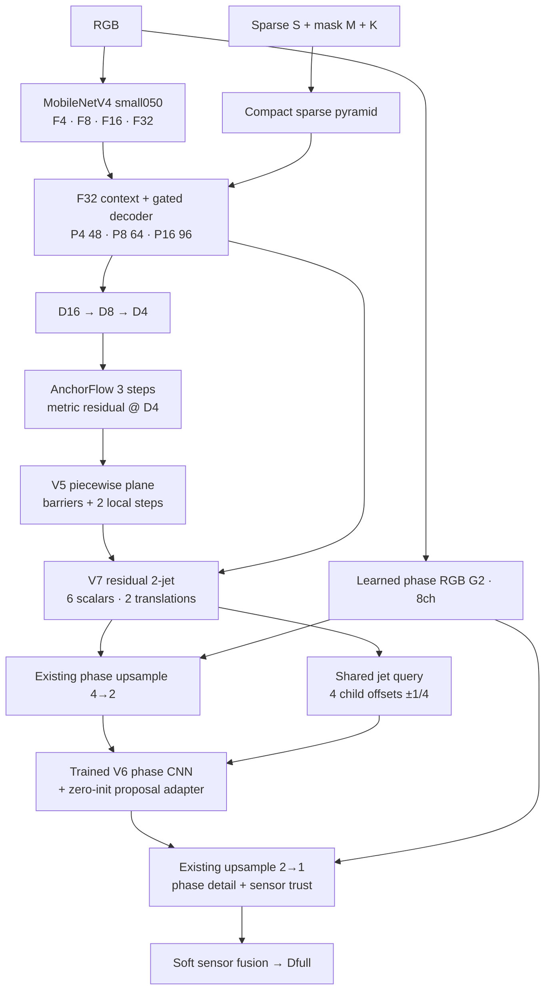

# AnchorFlow V7 — Residual Projective Jet Transport

**Implementation contract · 2026-10-03 · 1.600 train / 400 val / 1.000 anonymous test · FT15**

Mục tiêu: sửa các lỗi metric lớn và phục hồi subpixel geometry mà không thêm transformer, global solver, teacher inference hay CNN feature full-resolution. Gói này là candidate nghiên cứu; chưa có validation sau train V7.

## 1. Graph

Deploy API: `forward(rgb, sparse, mask, K)`. GT và D_cm/C_cm **không** vào forward. Sensor invalid được zero theo M và depth bounds. Confidence của output là learned sparse trust; không có branch uncertainty/jet confidence mới.

## 2. Giữ gì và thay gì?

| Component | V7 |
|---|---|
| Encoder/F32 context/sparse pyramid/decoder | Giữ weights, channels, feature sizes từ V6 |
| Quarter AnchorFlow | Giữ3steps,16-channel state |
| MetricRefine4 + V5 plane/barrier | Giữ toàn bộ |
| V6 connection body | Giữ trained62→64 CNN, gồm pointwise/LiteBlock/DW5 dilation2 |
| V6 vector head | Bỏ3-output195params; không tangent frame/cross/Rodrigues/ray-vector projection |
| Normal/ray descriptors | Vẫn dùng **detached FP32** để giữ input distribution cho body đã học; không gọi “normal-free” |
| V7 jet head | Conv1×1,64→6,390params, zero-init |
| PhaseMetric2 | Giữ body112→32 + trained32→4 output head |
| Proposal adapter | Conv1×1,4→32,128params, bias-free, zero-init; add trước BN/SiLU |
| Full-resolution learned feature | Không có; chỉ scalar readout và fusion ở1/1 |

1/4=88×304;1/2=176×608;full=352×1216. Tổng613.219params; V6=612.896. Chỉ518params mới,195params vector head bị bỏ. `encoder_pretrained=false` nghĩa là không tải ImageNet lần nữa: encoder pretrained/fine-tuned đã nằm trong parent student.

## 3. Nền tảng: perspective plane + local Taylor model

Với camera pinhole và optical-axis depth D, tọa độ3D là X=D K⁻¹[u,v,1]ᵀ. Plane nᵀX=c, c≠0, suy ra inverse-depth affine theo image coordinates:

$$
\xi(u,v)=\frac{1}{D(u,v)}=a u+b v+c_0.
$$

V7 dùng local polynomial bậc hai theo tọa độ **D4-cell** s,t, không phải manifold tangent coordinates:

$$
\xi_p(s,t)=v_p+g_{x,p}s+g_{y,p}t
+\frac12 h_{xx,p}s^2+h_{xy,p}st+\frac12 h_{yy,p}t^2.
$$

$$
j_p=[v_p,g_{x,p},g_{y,p},h_{xx,p},h_{xy,p},h_{yy,p}].
$$

H=0 biểu diễn plane trong perspective. H≠0 mô tả second-order **projective variation**, không intrinsic curvature. Đây là finite-order local approximation, không đảm bảo phù hợp occlusion/mixed-depth cells.

Base jet được lấy từ D4_surface detached: robust smaller-magnitude one-sided inverse-depth derivatives, Hessian bằng finite differences và mixed derivative đối xứng; derivative giới hạn ±0,25ξ. Base chỉ dùng compatibility/proposal, không hard-replace prediction.

Residual head sinh sáu coefficient, nhân detached ξ và tanh bounds:

$$
\Delta j_p=\xi_p\,[0.50,0.10,0.10,0.04,0.04,0.04]\odot\tanh(h_j(Z_p)).
$$

Đơn vị value:m⁻¹, gradient:m⁻¹/cell, Hessian:m⁻¹/cell². Z có64channels từ retained CNN; không thêm6separatebranches.

## 4. Analytic translation, không tạo ma trận6×6

Neighbor q được recenter vào p với Δ=(s_p−s_q,t_p−t_q). E/W/S/N offsets=(-1,0),(1,0),(0,-1),(0,1):

$$
v'=v+g_x\Delta s+g_y\Delta t
+\frac12 h_{xx}\Delta s^2+h_{xy}\Delta s\Delta t+\frac12 h_{yy}\Delta t^2,
$$

$$
g_x'=g_x+h_{xx}\Delta s+h_{xy}\Delta t,\qquad
g_y'=g_y+h_{xy}\Delta s+h_{yy}\Delta t,\qquad H'=H.
$$

Polynomial translation thỏa T(a)T(b)=T(a+b) trước clipping/gating. Code chỉ shift/split/add/multiply; không batched linear solve, inverse matrix, KNN, dynamic graph hay `grid_sample`.

V5 absolute symmetric edge weights w_old được nhân compatibility đối xứng p↔q từ base jet và hệ số0,5. Compatibility=.05+.95exp(−disagreement/tolerance), metric disagreement xấp xỉ |Δξ|D_pD_q, tolerance=.25+.01(D_p+D_q) m.

$$
w_{pq}=0.5\,w^{old}_{pq}\,\kappa_{pq},\qquad
0\le\sum_q w_{pq}\le0.5,
$$

$$
\Delta j_p^{k+1}=\left(1-\sum_qw_{pq}\right)\Delta j_p^k
+\sum_qw_{pq}T_{q\rightarrow p}(\Delta j_q^k),\qquad k=0,1.
$$

Weights và base-neighbor descriptor được compute một lần và reuse; stencil offsets là device-resident buffers, không copy Python list sang GPU mỗi forward. Không neighbor-only softmax: barrier đóng làm giảm transport thật. Không reuse GT-derived barriers trong forward.

Readout value sửa D4 bằng biểu thức inverse-depth residual ổn định:

$$
D_4'=\mathrm{clip}\left(
\frac{D_{4,surface}}{\mathrm{clip}(1+D_{4,surface}\overline{\Delta v},0.2,5)},
0.1,120\right).
$$

Guard được áp trong **model** trước reciprocal, không evaluator clamp để che outlier. Δv=0 trả D4_surface chính xác. Clipping làm mất tính group/equivariance toàn pipeline; không claim tuyệt đối.

## 5. Shared jet phase query: D4→D2

PixelShuffle order00/01/10/11 dùng child centers (-1/4,-1/4),(1/4,-1/4),(-1/4,1/4),(1/4,1/4). Tương ứng offsets±1full pixel. Không nhầm thứ tự x/y.

Existing up4_2 đã nhận D4′, vì vậy **không thêm lại residual value** tại D2. Chỉ thêm polynomial shape:

$$
\Delta\xi_{shape,c}=\overline{\Delta g_x}s_c+\overline{\Delta g_y}t_c
+\frac12\overline{\Delta h_{xx}}s_c^2
+\overline{\Delta h_{xy}}s_ct_c+\frac12\overline{\Delta h_{yy}}t_c^2.
$$

$$
D_{2,jet}=\mathrm{clip}\left(
\frac{D_{2,base}}{\mathrm{clip}(1+D_{2,base}\Delta\xi_{shape},0.2,5)},0.1,120\right).
$$

Full base+residual jet cũng được query thành **analytic proposal**, clip ξ trước reciprocal, rồi proposal error /20 được phase-pack4channels và add qua zero128-param adapter vào retained PhaseMetric2. Trained phase head tạo bounded metric residual `(1+.05D2_jet)*tanh(...)`; output+D2_jet.

Như vậy derivative coefficients có đường gradient trực tiếp qua D2_shape và gián tiếp qua proposal adapter. **Không gọi sáu coefficient fully identifiable**: một center chỉ thấy value, bốn phase đơn lẻ không thấy riêng hxx−hyy. Neighbor recentering bổ sung sampling locations nhưng không đảm bảo integrability/observability toàn cục.

## 6. Initialization chính xác

Parent: actual V6 best epoch14, SHA được pin trong bundle manifest. Cumulative59; thêm15epoch index0–14/cumulative60–74.

Chỉ bỏ `connection4.field.{weight,bias}`. Mọi tensor cũ khác phải tồn tại đúng shape; loader reject missing/extra. Jet/adapter zero-init. CNN phase output **không reset zero** vì nó đã học được ở V6.

Zero V7=**reduced V6** (connection vector OFF, learned context/phase ON). Không exact full V6 no-op; 400-image inference audit đo full1,009274 vs reduced1,009439m. Notebook vẫn đo full V6 cùng GPU trước train và so sánh riêng reduced initial.

## 7. Objective và GPU training

Giữ V6 GT Huber multi-scale coefficients0.025/0.05/0.15/0.30/0.50/1 choD16/D8/D4/D2/D1/Dfull; RMSE0.25; range-RMSE0.1; log0.2; edge0.05; sparse0.02; holdout0.05; sensor-trust BCE0.02; boundary-RMSE0.05; barrier BCE0.01. GT low-scale là **valid-area mean**, không phải point-center truth của analytic polynomial.

KD dùngD_cm/C_cm: thresholdC≥.5, excludeGT và toàn bộ sparse gốc (kể cả10%holdout), không calibration loss mới. Metric KD0.05→~0.025 trong15epoch; teacher-edge0.02. Coarse KD cell chứa bất kỳGT/sparse bị block toàn cell. GT luôn priority.

Thay weighted robust-MSE0.1 bằng:

$$
\mathcal L_{tail}=\frac{1}{\max(1,|\mathcal V|)}
\sum_{p\in\mathcal V}\left[\max(|D_{full,p}-D_{gt,p}|-2,0)\right]^2,
\qquad \lambda_{tail}=0.1.
$$

Không top-k/sort/moving quantile; normalization là **all valid GT count**. Gradient tăng theo(|e|−2), không saturate tại20m. Không gọi CVaR hoặc PINN. Sensor conflict chỉ ảnh hưởng sparse/trust target, **không xóa GT khỏi tail/global metric**. Squared tails nhạy label noise: theo dõi validation, clip grad1, không bảo đảm gain.

AdamW fused, channels-last, FP16 learned CNN/FP32geometry/loss, encoderBN frozen, batch4,1epochwarm-up/cosine,LR1e-4,encoder.1×,old1×,new2×,minLRratio.05. Không adaptive iteration count. Stats reduceGPU; chỉ sync theo log interval, không `.item()` trong model/jet stencil.

## 8. Hardware và kiểm chứng

| Component | Parameters | Conv/Linear MAC @352×1216 |
|---|---:|---:|
| RGB encoder | 340.992 | 0,536123 G |
| F32 context | 52.144 | 0,025307 G |
| Sparse pyramid | 4.896 | 0,050561 G |
| Gated fusion + decoder | 149.748 | **1,153172 G** |
| Quarter AnchorFlow3steps | 2.915 | 0,098019 G |
| MetricRefine4 | 7.073 | 0,178061 G |
| V5 piecewise surface | 7.976 | 0,202031 G |
| Retained context CNN + V7 jet | 24.326 | 0,628351 G |
| RGB phase guidance + context2 | 600 | 0,028250 G |
| Existing up4_2 | 6.016 | 0,152165 G |
| Retained phase CNN + adapter | 8.900 | 0,227713 G |
| Existing up2_1 | 2.488 | 0,241410 G |
| Phase detail + trust | 5.145 | 0,511070 G |
| **Tổng** | **613.219** | **4,032235 G** |

Theo convolution work, decoder lớn nhất, không phải jet6-outputhead. Tất cả hàng timing phải đo qua notebook; bảng này không đếm pool/shift/Taylor/exp/memory và không xếp hạng latency GPU từ MAC.

Conv/Linear MAC tăng rất nhỏ so với V6 do6-outputhead+adapter; không coi MAC là runtime. Loại tangent basis/cross/Rodrigues nhưng thêm6-channel neighbor tensors và phase query; memory bandwidth/kernel launches vẫn có thể chi phối. T=2compile-unrollable, tất cả geometry ở1/4 hoặcscalarphase1/2.

Notebook đo parent/candidate FP16batch1median/P95,peakVRAM và eagercomponent timing; exportONNXopset17staticbatch1; CPU checker/parity trên sparse và empty-sparse. Không hứa INT8/TensorRT/Jetson support hoặc latency khi chưa đo target.

Novelty hợp lý để **nghiên cứu**, không claim first-ever: *reuse a barrier-guided residual projective 2-jet for both quarter-scale metric correction and bias-preserving phase reconstruction, using fixed matrix-free translations and retained learned detail guidance*. Taylor expansion, inverse-plane geometry, continuous query và diffusion từng phần đều có prior art; cần matched ablation và literature review trước paper claim.

Nguồn nghiên cứu và phản biện cụ thể nằm tại [ANALYSIS_V6.md](ANALYSIS_V6.md). Source of truth: `model_v7.py`, `model.py`, `losses.py`, `run.py`, `config.json`; tests: `test_jet.py`, `test_surface.py`, `test_contracts.py`, `test_notebook.py`.
