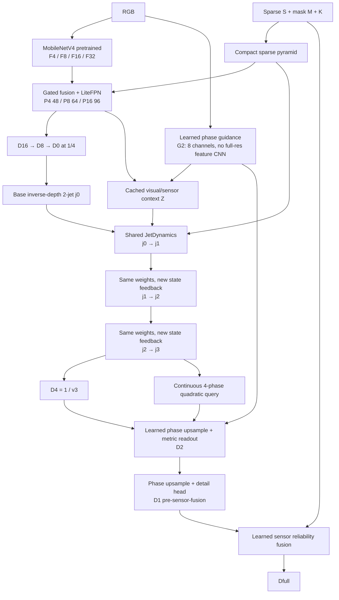

# AnchorFlow V8 — Feedback Jet Dynamics

> Status: implementation mới để train và kiểm chứng; chưa có trained V8 accuracy.
> KITTI TAR2000 · RGB + sparse depth + mask + K · 352 × 1216 · fresh tối đa epoch 0–29 + early stop.

## 1. Flow

Không dùng QuarterFlow/MetricRefine4/V5 surface/V6 vector head/V7 static jet trong forward mới. Không adaptive solver, recurrent full-res CNN, grid_sample, attention hoặc teacher inference.

## 2. State và tọa độ

Tại quarter-grid pixel p, inverse depth v = 1/D (m⁻¹). Jet chứa value, gradient và symmetric Hessian theo **quarter-grid pixel coordinates**, không phải camera-ray metric coordinates:

$$
j_p = [v_p,g_{x,p},g_{y,p},h_{xx,p},h_{xy,p},h_{yy,p}]^T.
$$

K vẫn dùng để tạo sparse ray channels ở pyramid. Jet transport không giả là 3D vector parallel transport; nó là đổi gốc một Taylor polynomial inverse depth. Các derivative channels là state học được, không bị ràng buộc exact global integrability.

j0 lấy value từ D0 differentiable; gradient/Hessian khởi tạo bằng finite differences của inverse depth detached (one-sided minimum magnitude để hạn chế nhảy qua boundary). Không có một CNN predict residual jet một lần để thay dynamics.

## 3. Learned vector field, recompute ở cả ba bước

$$
j_p^{k+1}=P\left(j_p^k+\Delta\tau F_{\theta,p}(j^k,Z,S,M,\tau_k)\right),
\qquad \Delta\tau=1/3,\quad k\in\{0,1,2\}.
$$

$$
F_{\theta,p}=R_{\theta,p}(j_p^k,Z_p,e_p^k,\tau_k)
+\sum_{q\in N_4(p)} c_{pq}^k\left[T_{q\to p}(j_q^k)-j_p^k\right].
$$

**Mỗi bước**:

1. Đọc current jet/value/relative change, current metric sparse error, inverse-depth innovation, valid mask, density, spread/reliability và pseudo-time. State input 14 channels.
2. Shared PW 14→32 + cached Z32; DW3×3 → SiLU → PW32→32 → SiLU. **Không BatchNorm trong loop**.
3. Heads 1×1 sinh learned reaction 6 channels, conductance 2 channels và sensor reaction gate 1 channel.
4. Recompute geometric compatibility từ current inverse-depth neighbor mismatch; apply analytic translation/transport.
5. Euler update + bounded projection; giữ graph differentiable qua ba bước.

Cached context xử lý P4(48) + packed G2(32) + initial sensor summary(7) → 32 channels, LiteBlock + DW5×5. Cached RGB boundary barriers chỉ cần tính một lần; **conductance còn phụ thuộc state** qua shared update head và geometric compatibility ở mỗi k.

## 4. Reaction và sparse feedback

Learned reaction:

$$
R_{\rm learned}^k = v^k\,b\odot\tanh(h_R(Z,j^k,e^k,\tau_k)),
\qquad b=[0.9,0.15,0.15,0.06,0.06,0.06]^T.
$$

Sparse value reaction dùng quarter valid-area pooled mean S4, không dùng GT:

$$
e_\xi^k=M_4\left(S_4^{-1}-v^k\right)/v^k,
\qquad r_S^k=\sigma(h_S)M_4\exp(-4\,{
m spread}_4)v^k\,\mathrm{clip}(e_\xi^k,-1,1).
$$

rS chỉ thêm vào value component. Pooled foreground/background mixed anchors bị downweight bằng spread; không hard-anchor tại intermediate steps. Reaction weights khởi tạo nhỏ std 0,001 nhưng không zero cả update: nhánh có gradient và feedback từ lần train đầu.

## 5. Analytic transport và safeguards

Với offset từ neighbor center tới target center `(dx,dy)` = (−1,0), (1,0), (0,−1), (0,1):

$$
v'=v+g_xdx+g_ydy+\tfrac12h_{xx}dx^2+h_{xy}dxdy+\tfrac12h_{yy}dy^2,
$$

$$
g_x'=g_x+h_{xx}dx+h_{xy}dy,\qquad
g_y'=g_y+h_{xy}dx+h_{yy}dy,\qquad H'=H.
$$

Hai learned undirected edge rates tạo E/W/S/N reciprocal weights, zero flux ở biên ảnh. Mỗi rate ≤0,6 sau sigmoid/barrier/compatibility; do đó `dt × sum(weights) ≤ 0.8`. Không dựng matrix NxN, không inversion/CG, chỉ shift/pad và broadcast.

P clamp value vào [1/120, 10] m⁻¹, mỗi gradient vào ±0,5v, mỗi Hessian entry vào ±0,25v. Geometry arithmetic FP32, learned conv chạy AMP. **Đây là bounded projected integrator**, không unconstrained Neural ODE; scalar mixing bound không chứng minh stability của full 6D transported jet, convergence hoặc monotone accuracy.

T=3 là fixed compute horizon, không chạy “đến hội tụ”. Full runtime vẫn cần đo trên GPU/TensorRT vì shifts/memory traffic không được tính bằng Conv MAC.

## 6. Continuous phase readout

At quarter-cell offsets `(s,t)` = (−0,25,−0,25), (+0,25,−0,25), (−0,25,+0,25), (+0,25,+0,25), đúng PixelShuffle order:

$$
\xi(s,t)=v+g_xs+g_yt+\tfrac12h_{xx}s^2+h_{xy}st+\tfrac12h_{yy}t^2.
$$

Query cho D2_geometry, blend với learned phase-upsample D2_base qua gate; geometric delta giới hạn ±(1+0,1D2_base) m. Nhánh tiny readout 80→24 + LiteBlock sinh 4-phase bounded metric detail, giữ khả năng sửa metric mà V7 log cho thấy có ích. D2_geometry có native metric log riêng; không tuyên bố nó luôn tốt hơn CNN upsampling.

D2→D1 vẫn phase CNN tại 1/2, không learned feature map full-resolution. Final:

$$
D_{\rm full}=(1-g_S)D_1+g_SS,\qquad 0\le g_S\le M.
$$

Sensor trust train bằng GT/sparse agreement **chỉ trong objective**. Forward/evaluation không nhận GT/teacher. D_hard chỉ là diagnostic, không output benchmark chính.

## 7. Training fresh và teacher contract

| Setting | Canonical |
|---|---|
| Student initialization | **Fresh**; không checkpoint V5/V6/V7 |
| RGB encoder | MobileNetV4 Conv Small 0,50 · ImageNet pretrained |
| Budget | Tối đa30 epochs, 0–29; run name `AnchorFlow_v8_Dynamics_Fresh30_ES` |
| Early stopping | Global val RMSE; patience7, min_delta0,001 m; không dừng trước15 completed epochs |
| Batch / effective batch | 4 / 4; AdamW fused, accumulation 1 |
| LR | decoder+dynamics 3e-4; encoder 1,5e-4 |
| Schedule | warm-up 1 epoch → cosine; min ratio 0,05 |
| Precision | CUDA FP16 AMP; geometry/reductions FP32 |
| BN / clipping | pretrained encoder BN frozen, weight fine-tune; grad clip 1 |
| Augmentation | paired horizontal flip + K adjustment; sparse holdout 10% |
| Data | fixed manifest 1.600 train / 400 val, IDs và raw drive disjoint |
| Teacher | D_cm, C_cm metric cache, **train only**; không geometry/DSINE |
| KD eligibility | C ≥0,5, valid teacher, exclude toàn bộ GT + original sparse (kể cả held-out sensor) |
| Resume | strict V8 source/config/data protocol; restore model/optimizer/scaler/RNG |

Early-stop counter/meaningful-best/stop flag restore từ checkpoint. Small gains accumulate relative to meaningful best. `best.pth` vẫn lưu strict raw RMSE minimum, độc lập min_delta. Stop đã trigger thì resume không train thêm; downstream evaluation/test dùng best. `training_status.json` báo actual epochs/stop reason. LR/KD schedule vẫn theo max30 horizon, không rescale vì early stop; control phải cùng stopping policy và báo actual training budget.

L metric Huber đa scale weights D16/D8/D4/D2/D1/Dfull = 0,025/0,05/0,15/0,30/0,50/1. Auxiliary step1/2 = 0,1 × mean hai quarter-grid Huber losses. Các term khác: RMSE 0,25; range RMSE 0,1; log 0,2; edge 0,05; sparse 0,02; holdout 0,05; trust 0,02; metric KD 0,05→0,025; teacher edge 0,02; GT boundary RMSE 0,05; barrier BCE 0,01; squared excess-tail >2 m 0,1.

**Tất cả network modules và supervision chính bật từ epoch 0.** Riêng squared tail multiplier ramp linear 0→1 theo fractional epoch 0→2 vì scratch errors lớn; không phải Stage A/B/C hay gate manually mở. Loss weights khác unit/magnitude; không được gọi là tỷ lệ phần trăm ngân sách thực tế.

Metric teacher có thể là privileged cache được sinh với GT; đây là **supervised privileged distillation**, không independent teacher-only benchmark. Cache provenance phải xác minh bằng metadata/script generation; D_cm/C_cm không đủ chứng minh “chỉ DMD3C”. Không dùng teacher để chọn mask validation.

## 8. Evaluation và hiệu năng

Primary: global valid-pixel RMSE m, cùng protocol V7; MAE, inverse metrics km⁻¹, range [0,20,40,60,80,120], RGB edge, GT boundary bands/rings, error-tail SSE. D0/D4_step1/2/3 share native GT target. Anonymous 1.000 test không public GT, chỉ export PNG uint16×256 ZIP.

Log forcing/transport/normalized state changes/mixing mass/sensor residual mỗi k; tests kiểm tra field thay đổi khi perturb j, ba vector-field calls đọc ba state khác nhau, gradients tới cả sáu reaction channels, empty sparse, BF16, resume và ONNX.

Parameter count: **578.064** (V7 613.219, giảm 5,73%). Conv/Linear MAC và component breakdown được ghi trong `local_verification.json`, và notebook profile đo trained model. Shared conv dùng ba lần được đếm đủ ba lần, không lấy parameter sharing để ngụy tạo compute thấp. Không công bố một latency GPU từ CPU timing.

| Component | Parameters | Conv/Linear MAC, batch 1 |
|---|---:|---:|
| MobileNetV4 RGB | 340.992 | 0,536 G |
| F32 context | 52.144 | 0,025 G |
| Sparse pyramid | 4.896 | 0,051 G |
| Gated fusion + pyramid decoder | 149.748 | **1,153 G** |
| Learned guidance | 200 | 0,018 G |
| JetDynamics, đủ 3 shared calls | 10.891 | 0,387 G |
| Phase upsample 4→2 | 6.016 | 0,152 G |
| Jet phase readout | 5.144 | 0,130 G |
| Context2 | 400 | 0,010 G |
| Phase upsample 2→1 | 2.488 | 0,241 G |
| Detail + sensor trust | 5.145 | 0,511 G |
| **Tổng** | **578.064** | **3,2147 G** |

V7 Conv/Linear MAC 4,0322 G → V8 3,2147 G, giảm **20,27% theo phép đếm này**. Gated decoder là nhóm MAC lớn nhất; không suy ra đó chắc chắn là nhóm latency chậm nhất. Stencil/jet transport, pooling, interpolation, softmax, fixed neighborhood conv và memory traffic chưa tính trong MAC; notebook sẽ đo runtime thật.

## 9. Cơ sở khoa học và claim hợp lệ

| Paper | Phần kế thừa / khác biệt |
|---|---|
| [Chen & Pock, TNRD, TPAMI](https://arxiv.org/abs/1508.02848) | Learned reaction–diffusion cho image restoration, nền tảng unrolling/GPU. V8 dùng analytic inverse-depth jet transport và sensor reaction, không claim phát minh TNRD. |
| [Chen et al., Neural ODE, NeurIPS 2018](https://arxiv.org/abs/1806.07366) | Learned state-space vector field; V8 chỉ discretization fixed Euler + projection, không adaptive solver/adjoint hay continuous-limit guarantee. |
| [Zuo & Deng, OGNI-DC, ECCV 2024](https://www.ecva.net/papers/eccv_2024/papers/00319.pdf) | Feedback depth/gradient refinement với differentiable integration. V8 bỏ global integration/CG/GRU, local 6D jet stencil T=3 và continuous phase readout. |
| [Zuo et al., OMNI-DC, ICCV 2025](https://openaccess.thecvf.com/content/ICCV2025/html/Zuo_OMNI-DC_Highly_Robust_Depth_Completion_with_Multiresolution_Depth_Integration_ICCV_2025_paper.html) | Multiresolution integration xử lý sparse/long-range constraints; V8 giữ F32 context nhưng không equivalent global solver. Paper bỏ ConvGRU recurrent updates vì không thấy hữu ích trong setting large-scale training của họ. |
| [Lin et al., DySPN, AAAI 2022](https://ojs.aaai.org/index.php/AAAI/article/view/20055) | Affinity thay đổi theo iteration đã có prior art trong depth propagation. Claim V8 tập trung vào feedback của six-component jet + analytic origin transport/query, không chỉ “dynamic affinity”. |

**Proposed contribution**: sensor-conditioned, feedback-recomputed quadratic inverse-depth jet evolution with analytic change-of-origin transport and phase readout under a fixed edge-oriented compute budget. Đây là claim thiết kế cần ablation/novelty literature review rộng hơn trước publication, không “first neural PDE for depth completion”. Không gọi PINN vì không có physics-equation residual supervision; không gọi learned 2D displacement vì không dự đoán sampling-coordinate flow.

Phản biện quan trọng từ [OMNI-DC, implementation §4.2](https://openaccess.thecvf.com/content/ICCV2025/papers/Zuo_OMNI-DC_Highly_Robust_Depth_Completion_with_Multiresolution_Depth_Integration_ICCV_2025_paper.pdf): recurrence không tự bảo đảm accuracy cao hơn, và đã bị bỏ trong một setting train lớn. V8 giữ T=3 vì đây là giả thuyết inductive bias có thể hữu ích với 1.600 ảnh train, không extrapolate thành kết luận. Phải đo bằng frozen-feedback control; tăng số steps không thay thế được supervision/data đủ tốt.

Control `v8_frozen_feedback` cùng parameters/steps/recipe và early-stop policy nhưng learned field đọc j0; train riêng để isolate state feedback, báo actual epochs. So fresh tối đa30 với V7 đã accumulated75 chỉ là historical comparison. Accuracy <0,8 m và edge latency chưa được chứng minh.

## 10. Source of truth

`model.py`: JetDynamics, JetPhaseReadout, AnchorFlowEdge. `core.py`/`support.py`: CNN primitives. `losses.py`: training-only objective. `data.py`: paired split/teacher gates. `metrics.py`/`boundaries.py`: unchanged protocol. `run.py`: train/evaluate/test/profile/export. Notebook canonical: [`AnchorFlow_v8_Dynamics_TAR2000_Fresh30_EarlyStop.ipynb`](AnchorFlow_v8_Dynamics_TAR2000_Fresh30_EarlyStop.ipynb).
