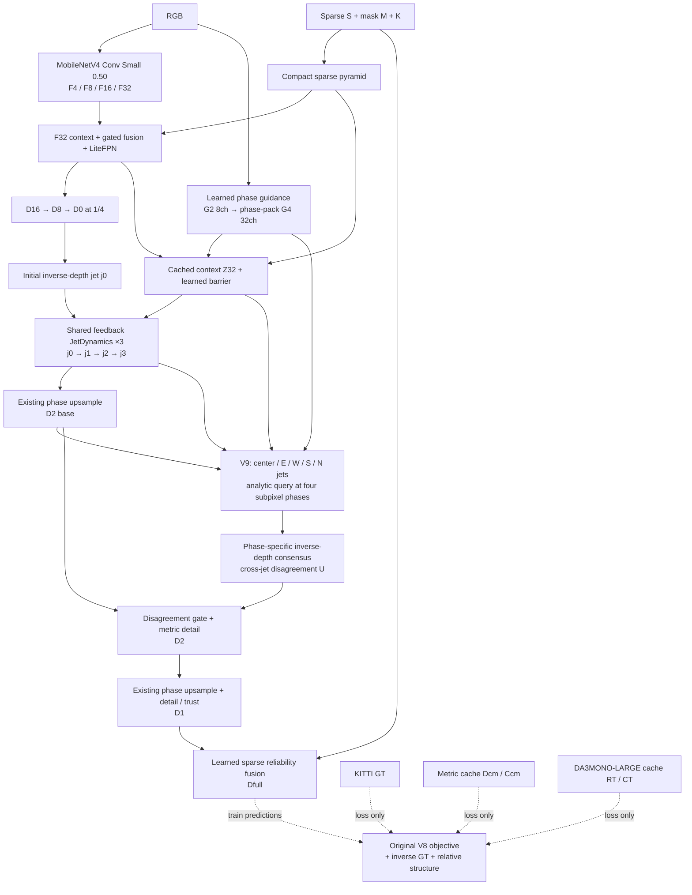

# AnchorFlow V9 — Barrier-Aware Multi-Jet Consensus

> Đặc tả implementation · 2026-10-04 · RGB + sparse → metric depth.  
> Fresh student, ImageNet RGB initialization; metric + relative teachers chỉ ở training objective.  
> Nâng **readout**, không thay backbone hay tăng số bước dynamics.

## 1. Flow

| Contract | Giá trị |
|---|---|
| Model / key | `AnchorFlowEdge` / `v9_consensus` |
| RGB encoder | `mobilenetv4_conv_small_050.e3000_r224_in1k`; fine-tune weights, freeze encoder BN |
| Input | RGB `[B,3,352,1216]`; sparse/mask `[B,1,352,1216]`; K `[B,3,3]` |
| FPN width P4/P8/P16 | 48 / 64 / 96 channels; context32 width 32 |
| Geometry grid / guidance | 88×304 at 1/4; G2 8ch at 1/2, G4 32ch at 1/4 |
| Main output | `D_full`: metres, 0.1–120; learned sensor fusion |
| Diagnostic output | `D_hard`: hard sparse anchor, không output chính |
| Teachers at inference | Không; chỉ RGB/S/M/K |

## 2. Geometry state và dynamics — giữ nguyên V8

Jet là local quadratic inverse-depth representation, không phải optical flow/displacement của pixel:

$$
j_p=[v_p,g_{x,p},g_{y,p},h_{xx,p},h_{xy,p},h_{yy,p}]^T,
\qquad v_p=D_p^{-1}.
$$

Với offset trong **quarter-grid cells**, query polynomial:

$$
Q(j;s,t)=v+g_xs+g_yt+\tfrac12h_{xx}s^2+h_{xy}st+\tfrac12h_{yy}t^2.
$$

Initial jet lấy inverse depth D0 và finite differences; derivative initialization được detach, v vẫn differentiable. V8/V9 cùng ba projected Euler updates, shared weights, step size 1/3:

$$
j_p^{k+1}=\Pi\!\left[j_p^k+\tfrac13\left(R_\theta(Z_p,j_p^k,S,M,k/3)+\sum_q w_{pq}^k[T_{q\to p}(j_q^k)-j_p^k]\right)\right],
\qquad k=0,1,2.
$$

Reaction dùng RGB context + current state + sparse innovation; conductance và geometric compatibility được refresh mỗi bước. Barrier được predict một lần từ cached context. Projection giữ v trong `[1/120,10]`, gradient trong `±0.5v`, Hessian trong `±0.25v`. Đây là **fixed-horizon learned dynamics**, không claim ODE convergence/physical PDE solution.

## 3. Điểm mới: năm transported jets cùng query một phase

Tại mỗi cell p, lấy `center,E,W,S,N`. Phase theo PixelShuffle order `(y,x)`:
`(-1/4,-1/4),(-1/4,+1/4),(+1/4,-1/4),(+1/4,+1/4)`.

Nếu origin neighbor q lệch `(o_x,o_y)` so với p, inverse candidate:

$$
\xi_{q,r}=\mathrm{clip}\big(Q(j_q;s_r-o_x,t_r-o_y),1/120,10\big).
$$

Đây là analytic change of origin tới **đúng vị trí target phase**, không copy giá trị center neighbor. Out-of-image candidates bị mask; luôn có center. Tất cả candidate/phase được xử lý bằng tensor broadcast; không grid_sample, sorting, adaptive solver hoặc matrix NxN.

Existing readout hidden Z có 24 channels. Một head `1×1:24→20` tạo 5 logits × 4 phases; init W=0, center bias=1.5, các neighbor bias=0. Logits:

$$
\ell_{q,r}=4\tanh(h_{q,r}(Z)/4)-\min\!\left(6,\frac{|1/\xi_{q,r}-B_r|}{1+0.1B_r}\right)-2b_{pq},
\qquad a_{q,r}=\mathrm{softmax}_q(\ell_{q,r}).
$$

B là `D2_base`; b là reused sigmoid barrier cho cạnh center→neighbor; center barrier=0. Invalid logits thêm −10000. RGB phase guidance/sparse compatibility đi vào existing hidden head; **không thêm riêng một RGB pair-distance branch**.

Consensus và disagreement được tính trong inverse-depth space:

$$
\bar\xi_r=\sum_q a_{q,r}\xi_{q,r},
\qquad Q_r=1/\bar\xi_r,
\qquad U_r=\frac{\sum_q a_{q,r}(\xi_{q,r}-\bar\xi_r)^2}{\max(\bar\xi_r^2,10^{-6})}.
$$

U là **relative geometric variance không đơn vị**, không calibrated predictive uncertainty. Candidate cùng planar surface cho U≈0; khác surface có thể tăng U, nhưng không bảo đảm phát hiện mọi occlusion. Dùng inverse consensus nhất quán với state thay vì arithmetic average metric depths.

$$
g_r=\sigma\!\left(h_{g,r}(Z)-\mathrm{softplus}(\beta_r)\log(1+U_r)\right).
$$

Existing blend head init bias −1.4; bốn strength parameters init softplus=0.5. Sau phase-unpack:

$$
D_2=\mathrm{clip}\!\left[B+g\,\mathrm{clip}(Q-B,-(1+0.1B),1+0.1B)+(1+0.05B)\tanh(h_\delta(Z)),0.1,120\right].
$$

Metric detail head khởi tạo zero. D1/detail/trust và soft sensor fusion giữ nguyên V8. Query tốt thì gate có thể mở; query bất đồng thì gate giảm, không ép analytic geometry thay learned base.

## 4. Hai teacher có vai trò khác nhau

| Cache | Representation | Supervision |
|---|---|---|
| `metric_coarse_train_2000.tar` | D_cm mét; C_cm reliability | Existing V8 metric/log KD tại D4/D2/D1 và teacher gradient tại D2 |
| `relative_teacher_2000_DA3MONO_LARGE.tar` | R_T standardized inverse depth, larger=near; C_T flip-agreement | Local normalized inverse-gradient + smooth ordinal tại D2 |

Relative teacher chọn **DA3MONO-LARGE**, official monocular model, không metric/any-view giant. Đây là ứng viên relative mạnh và phù hợp workflow, **không khẳng định số 1 trên mọi benchmark/KITTI**. [Official model](https://huggingface.co/depth-anything/DA3MONO-LARGE), [official code](https://github.com/ByteDance-Seed/Depth-Anything-3).

Generator: RGB-only, single view, resize full frame không crop, inference gốc + horizontal flip/unflip. Official DA3MONO trả **depth**, nên inverse trước normalize; không đảo nhầm convention DA2. Với mỗi pass:

$$
r=\frac{D_T^{-1}-\mu(D_T^{-1})}{\max(\sigma(D_T^{-1}),10^{-8})},
\qquad R_T=\tfrac12(r+r_{\mathrm{flip}}),
\qquad C_T=\exp(-|r-r_{\mathrm{flip}}|).
$$

Chỉ pixel finite, positive, non-sky ở cả hai pass có confidence; sky probability ≥0.3 bị loại. Constant/insufficient-support teacher fail rõ. C_T là TTA heuristic, không sensor confidence. Pinned HF/Git revisions và per-image SHA256 nằm trong recipe/archive.

GT và original sparse sensor có ưu tiên: không KD ở pixel có GT/sensor; tại scale thấp, block cell nếu bất kỳ pixel GT/sensor rơi vào cell. Holdout sparse vẫn được block. Val/test không load teacher.

## 5. Training objective

$$
\mathcal L_{V9}=\mathcal L_{V8}+0.01\mathcal L_{\mathrm{inv}}+0.05r(e)\left(\mathcal L_{\mathrm{relative\ grad}}+0.1\mathcal L_{\mathrm{ordinal}}\right),
\qquad r(e)=\min(1,e/3).
$$

Giữ objective V8, gồm GT multiscale Huber coefficients `D16 .025 / D8 .05 / D4 .15 / D2 .30 / D1 .50 / Dfull 1`, global RMSE .25, range RMSE .1, log .2, edge .05, reliability sparse .02, holdout .05, trust .02, boundary .05, barrier .01, dynamics aux .1. Metric KD .05 decay tới .025 trong 30 epoch; teacher edge .02. Squared-excess tail >2m .1 ramp 2 epoch, **không đổi thành hard-capped top-k**.

Inverse GT term, native valid-area-mean GT target G_s:

$$
\mathcal L_{\mathrm{inv}}=\sum_{s\in\{4,2,1\}}\omega_s\,\mathrm{mean}_{p\in V_s}\rho_1\!\left(100\left[D_s(p)^{-1}-G_s(p)^{-1}\right]\right),
\qquad (\omega_4,\omega_2,\omega_1)=(0.25,0.5,1).
$$

Scale factor 100 giúp inverse term không biến mất về magnitude; benchmark iRMSE vẫn dùng factor **1000 km⁻¹**. D1 ở term này là **D_full**, không D1 pre-fusion.

Relative KD pool teacher về D2 theo confidence, C≥0.35; normalize student inverse/teacher locally 17×17 bằng valid-only mean/std, variance floor 1e−6, window support >25%. Pair offsets 1 và 4 pixels theo x/y; pairweight là min confidence hai đầu, chỉ nhận eligible pair có teacher normalized difference >.05 hoặc RGB grayscale difference >.05.

$$
\mathcal L_{\mathrm{relative\ grad}}=\mathrm{weighted\ mean}\,\rho_{0.25}(\Delta z_D-\Delta z_T),
$$

$$
\mathcal L_{\mathrm{ordinal}}=\mathrm{weighted\ mean}\,\mathrm{softplus}\!\left[-\mathrm{sign}(\Delta z_T)\Delta z_D/0.5\right],
\quad |\Delta z_T|>0.1.
$$

Weighted mean chia **eligible pair count**, không weight sum: low confidence thực sự giảm tín hiệu. Trung bình đều bốn hướng/offset combinations. Positive affine transform teacher không đổi structure loss nếu chưa chạm numerical floor; không force relative teacher thành metric depth.

## 6. Recipe, evaluation và footprint

Fresh student, không V8 checkpoint; encoder ImageNet pretrained. Train 1.600 / val 400 / anonymous test 1.000; 352×1216, global pixel aggregation như V8. Max30, early-stop patience7, min_delta .001m, min_epochs15. AdamW LR3e−4; encoder LR0.5×, warmup1epoch + cosine min ratio.05, batch4, BF16 từ đầu, channels-last, clip1.0, freeze encoder BN. All modules train end-to-end; không curriculum bật/tắt kiến trúc.

| Footprint tại batch1, 352×1216 | V8 | V9 | Tăng |
|---|---:|---:|---:|
| Parameters | 578.064 | 578.568 | +504, +0,087% |
| Conv/Linear MAC | 3,214694 G | 3,227535 G | +0,012841 G, +0,399% |
| Measured GPU median | 10,221 ms historical BF16 | **Chưa đo** | Không suy latency từ MAC |

Multi-jet tạo thêm candidate tensor/broadcast/softmax/variance và memory traffic; chi phí này không nằm trong Conv/Linear MAC. Cache teacher tăng train I/O/loss compute, **không deploy parameters**. Notebook profile trained checkpoint trên GPU, export static B1 ONNX17 và CPU parity; TensorRT latency chưa được bảo đảm.

Validation log global/range/edge/iRMSE, GT-boundary bands, absolute tail SSE + tail pixel rates, native stage metrics `D2_base/query/D2`, gate/U/entropy/center weight. Đồng thời log D4 từng dynamics step, pre-fusion và hard-anchor diagnostic. Native-stage RMSE khác scale không so trực tiếp như cùng một target grid.

Source of truth: `model.py`, unchanged `model_v8.py`, `losses.py` + unchanged `losses_v8.py`, `data.py`, `relative_data.py`, `generate_relative.py`, `config.json`, `run.py`.
